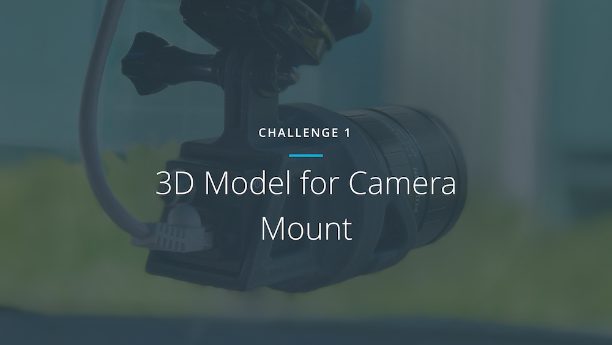

  

## Challenge #1

We beta tested our first challenge with a small set of Udacity students and self-driving car enthusiasts. The challenge was to create a 3D model for a mount for our Point Grey cameras to hook in to a GoPro mount.

You can read more information [about the results of this challenge here](https://medium.com/p/f5ffcc1655b5).

## Hardware

* Blackfly GigE Camera ([BFLY-PGE-23S6C-C](https://www.ptgrey.com/blackfly-23-mp-color-gige-poe-sony-pregius-imx249))
* Fujinon 12.5mm focal length C-mount lens ([Fujinon CF12.5HA-1](http://www.fujifilmusa.com/products/optical_devices/machine-vision/1-15-mp/cf125ha-1))

## Contributors
[@ericrgon](https://twitter.com/ericrgon) 
[@macjshiggins](https://twitter.com/macjshiggins) 
[@olivercameron](https://twitter.com/olivercameron) 
[@spartanhaden](https://twitter.com/spartanhaden) 

 # Archival Note 
 This repository is deprecated; therefore, we are going to archive it. However, learners will be able to fork it to their personal Github account but cannot submit PRs to this repository. If you have any issues or suggestions to make, feel free to: 
- Utilize the https://knowledge.udacity.com/ forum to seek help on content-specific issues. 
- Submit a support ticket along with the link to your forked repository if (learners are) blocked for other reasons. Here are the links for the [retail consumers](https://udacity.zendesk.com/hc/en-us/requests/new) and [enterprise learners](https://udacityenterprise.zendesk.com/hc/en-us/requests/new?ticket_form_id=360000279131).